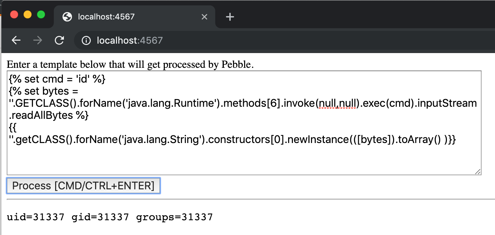

# Info

This folder contains a Docker container that runs a simple Java application with [Pebble Template engine](https://pebbletemplates.io/). It accompanies the blog post about [Server-Side Template Injection in Pebble](https://research.securitum.com/server-side-template-injection-on-the-example-of-pebble/) posted in Securitum Research blog. You can test payloads mentioned in the blog post.

# Getting started

1. Make sure you have `docker` and `docker-compose` installed.
2. Just run:

```
docker-compose up
```

3. The application runs on http://localhost:4567.




You can also specify the version of Pebble to run with `PEBBLE_VERSION` environmental variable. Examples:

* **Run Pebble version 3.0.8**

```
PEBBLE_VERSION=3.0.8 docker-compose up
```

* **Run the current newest version of Pebble**

```
PEBBLE_VERSION=master-SNAPSHOT docker-compose up
```

